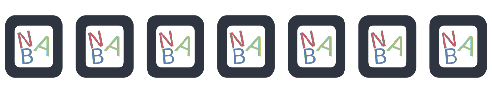
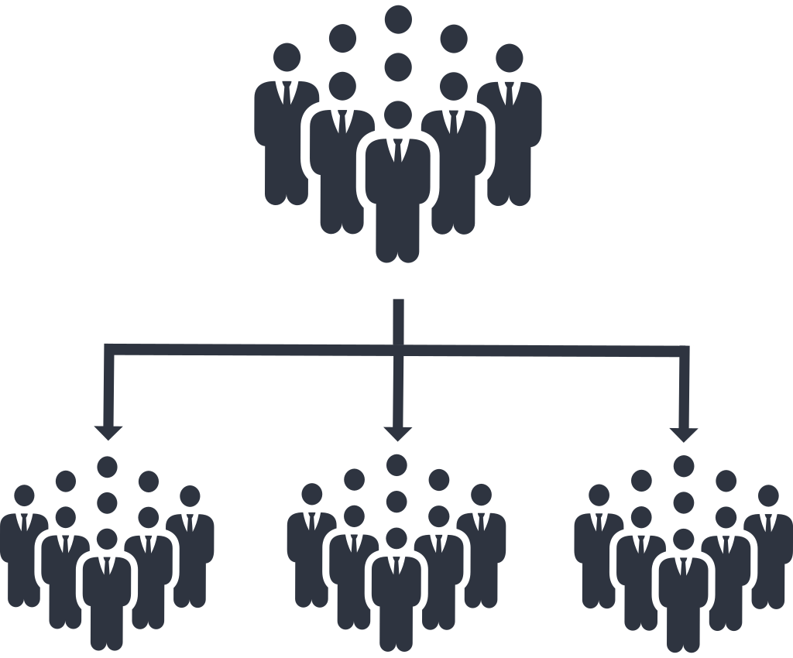
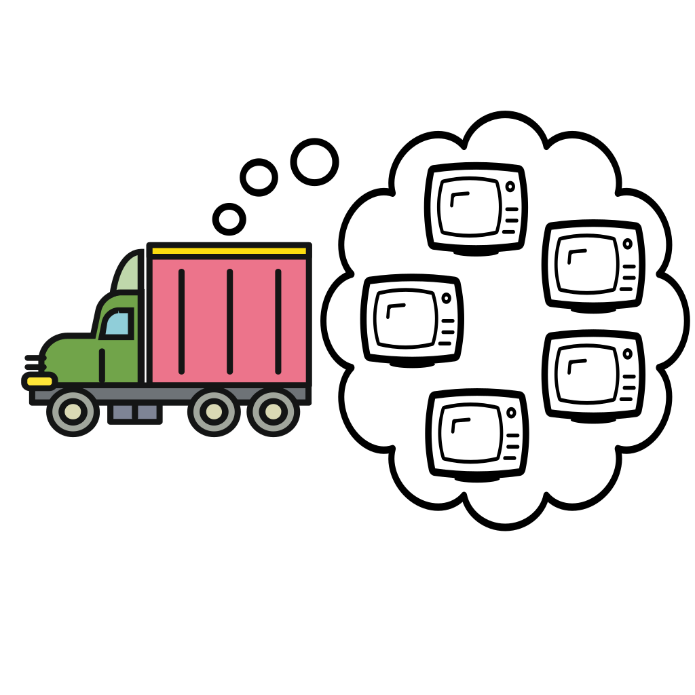
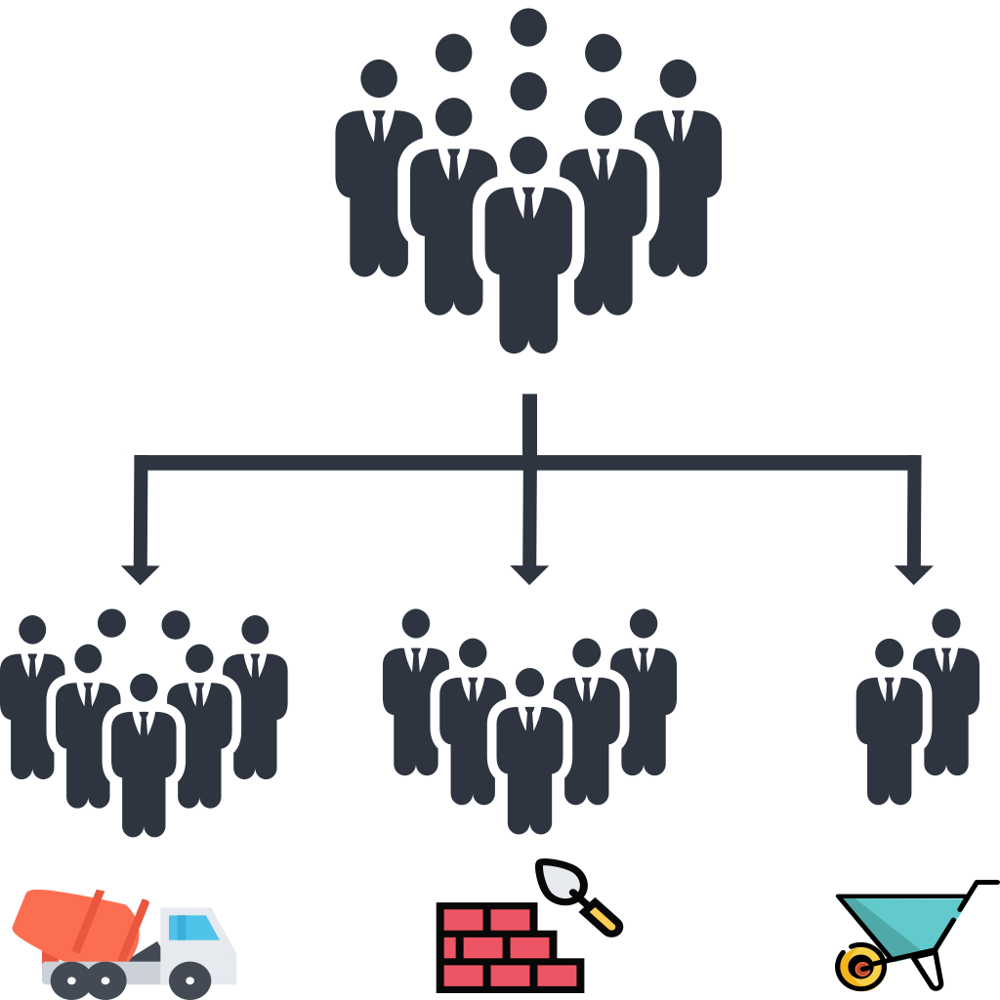
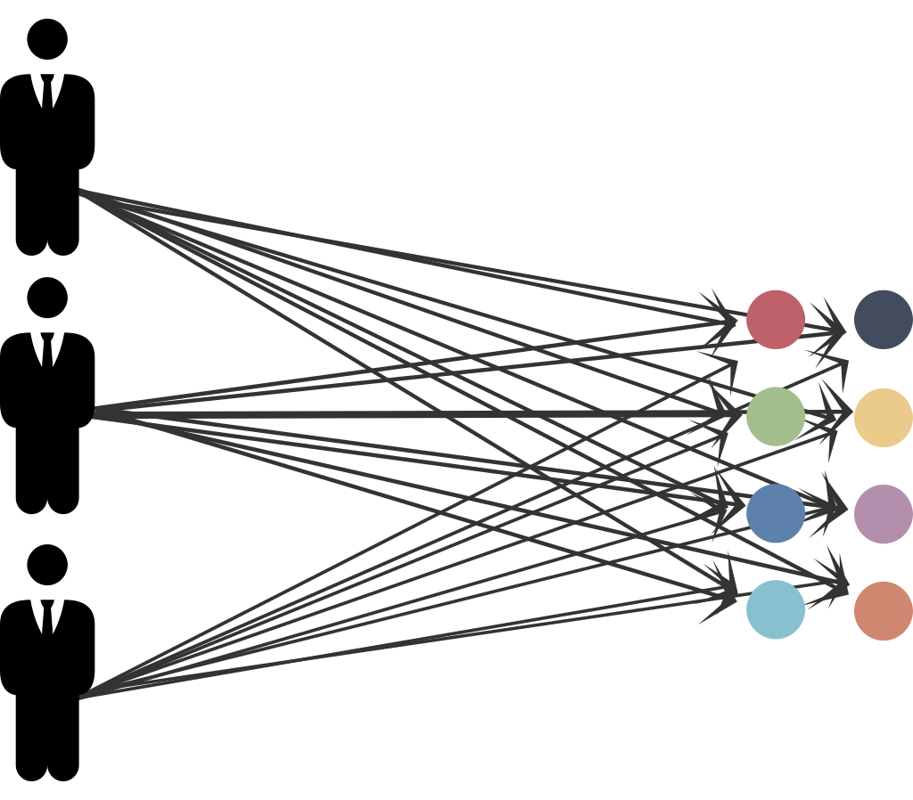
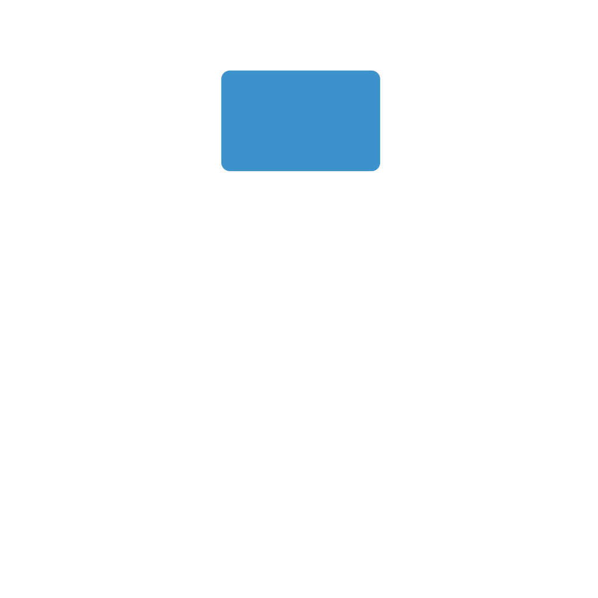
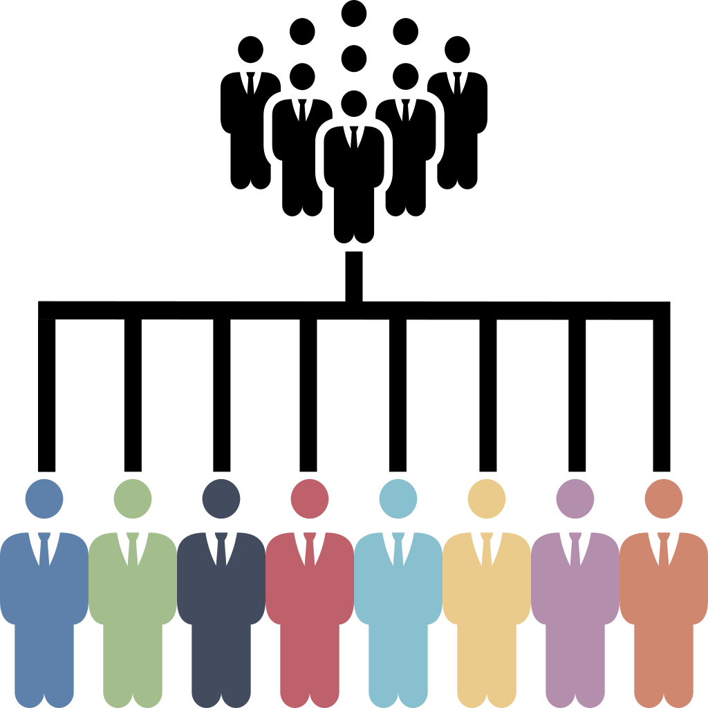
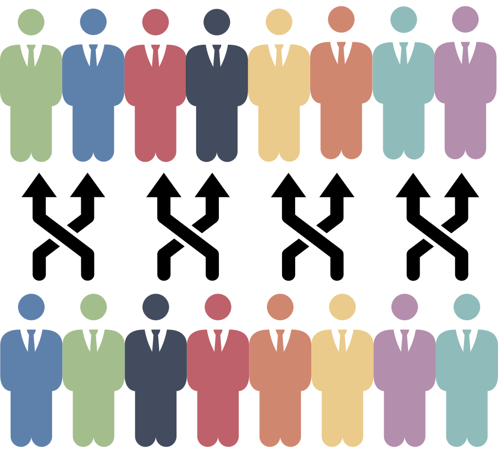

### Problem: combinatorics math word problems

Combinatorics math word problems sketch in natural language a configuration of a finite set of objects and (possibly) some constraints. The task is to *count* the number of valid arrangements for the objects. For example:

> In how many different ways can the letters in B A N A N A be written? 

> Fourteen construction workers are to be assigned to three different tasks. Seven workers are needed for mixing cement, five for laying bricks,and two for carrying the bricks to the brick layers. In how many different ways can the be assigned to these workers tasks? 

> A shipment of 12 different TVs contains 3 defective ones. In how many ways can a hotel purchase 5 of these TVs and receive at least 2 of the defective ones? 

Such problems present two challenges for AI:

1. *NLP* - Understanding setting, objects, quantities, and the question provided in natural language. 
2. *Automated reasoning* - Finding a solving strategy to answer the question from the given information. 


In this paper we consider a *two-step approach* to solving combinatorics math word problems.
The two-step approach addresses the two AI challenges in two stages: 
1. translating the problem expressed in natural language in a formal, machine-understandable language,
2. applying automated reasoning methods (solver) to the formalization of the problem to infer the solution.


This approach showed more promising results on similar tasks than an *end-to-end* approach, where a neural network predicts the answer directly from the text. This however showed several limitations:
- Poor solving performance (esp. on a small dataset)[^1]
- Lacking generalizability [^2]
- Lacking explainability [^3]


In the two-step approach the intermediate language simplifies the task of the neural network by moving the automated reasoning challenge to a logic-based framework, which offers considerably more generalizability and explainability opportunities.
The challenge in a two-step approach is to have an intermediate formal language as expressive as possible, and at the same time to develop (efficient) inference methods for all possible problems expressible in the formal language. 
Current declarative frameworks either offer languages that are not expressive enough for the class of problems at hand or inference methods that are very inefficient.

We address these limitations with the following contributions:
1. CoLa - a formal language to encode combinatorics math word problems,
2. CoSo - a solver to automatically (and efficiently) reason over and solve problems expressed in CoLa.


[^1]: [S.Suster, P.Fivez, P.Totis, A.Kimmig, J.Davis, L. de Raedt, W.Daelemans, "Mapping probability word problems to executable representations" EMNLP 2021]()
[^2]: [A.Patel, S.Bhattamishra, and N.Goyal, "Are NLP Models really able to Solve Simple Math Word Problems?", NAACL 2021](https://aclanthology.org/2021.naacl-main.168/)
[^3]: [D.Saxton E. Grefenstette F. Hill P. Kohli, "Analysing Mathematical Reasoning Abilities of Neural Models", ICLR 2019](https://openreview.net/pdf?id=H1gR5iR5FX)

### CoLa: modelling combinatorics math word problems

CoLa is a novel declarative language designed to model combinatorics math word problems, for which we also developed efficient reasoning techniques (implemented in the solver CoSo).
Existing declarative language, such as logic-based languages (Answer Set Programming, Prolog,...) and constraint modelling languages, do not directly support all of the fundamental primitives to encode combinatorics math word problems. The three primitives necessary to formally encode combinatorics math problems are the following. 

#### Multisets

Multisets are collections of objects where any object can have a number of identical copies. For example, the letters in B A N A N A are a multiset where A B and N are the distinguishable objects, and there are 3 identical copies of A and 2 of N.


In CoLa multisets, in particular the *universe*, can be declared by enumeration, repeating the labels of identical copies, or by specifying the property characterizing the copies and their number (with a *size constraint*):

```
universe letters = {a,a,a,n,n,b} % enumeration
```

```
property a; property n; property b; % distinguishable properties
#a=3; #n=2; #b=1; % identical copies
```

The keyword ``labelled`` can be used to specify a regular set where all elements are unique
```
labelled property workers;
#workers = 14;
```

```
labelled property tvs;
#tvs = 12;
labelled property defective;
#defective = 3;
```

#### Configurations

Configurations define how objects are arranged:
- Objects are *ordered/unordered* (e.g. sets vs. permutations)
- Objects are placed *with or without repetition* (e.g. multisets vs. sets)
- Objects are arranged in a *single or multiple groups* (e.g. sets vs. partitions) 


CoLa offers several statements to express the most common configurations, based on the [Twelvefold-way](https://en.wikipedia.org/wiki/Twelvefold_way)[^4]. 
These configurations are fundamental because they can be counted quickly with combinatorial rules, such as factorials or binomial coefficients.

[^4]: [R.Stanley, "Enumerative combinatorics", 2012, Cambridge University Press, New York.](https://math.mit.edu/~rstan/ec/)

```
word in [letters] % a permutation of letters: a word
```


```
groups in [{workers}]; % a composition of workers: an ordered partition 
```



```
purchase in {tvs}; % a subset of TVs
```



#### Constraints

Constraints define restrictions on how objects are arranged in the configuration. While natural language can express virtually any kind of constraint, in CoLa we restrict to few constraints that are interesting in terms of efficient resolution of combinatorics math word problems:
- *Size constraints* - define the size of configurations, properties and multisets.
  ```
  #groups=3; % specify the number of groups of workers
  ```
  ```
  #tvs&defective = 3; % specify the number of tvs that are defective
  #purchase = 5; % specify the number of purchased TVs 
  ```

- *Positional constraints* - define the properties of objects in specific positions in an ordered configuration.


  ```
  #groups[1] = 7; % size constraints on the index of the groups of workers
  #groups[2] = 5;
  #groups[3] = 2;
  ```
- *Counting constraints* - define the number of objects in a configuration or subset with the given property. 

  ```
  #(defective & purchase) >= 2;
  ```


### CoSo: reasoning over combinatorics math word problems

CoSo implements lifted reasoning techniques for combinatorics math word problems. Lifted reasoning exploits high-level symmetries and the interchangeability of objects to efficiently count the number of admissible assignments for a set of variables. 
In this paper we implement the principles of *probabilistic* lifted reasoning[^5] in the context of *counting constraint satisfaction problems* (#CSPs).

Existing declarative frameworks usually resort to *propositional* reasoning, that is, enumeration of the solutions or grounding, namely replacing each variable with all possible individual objects in its domain. Therefore, they can be very inefficient on combinatorics math word problems, where the number of solutions is usually exponential in the number of objects.

CoSo can solve these problems efficiently by applying the following lifted reasoning principles:
1. Multiplication - multiply the solution of two *independent* subproblems to lift the count of their combinations.

2. Splitting - decompose a problem into subproblems such that the multiplication principle is applicable.

3. Propositionalization - reason on individual objects when it is not possible to group them.

4. Exchangeability - account for any invariance under permutation of the variables.


CoSo applies these principles to decompose a problem in subproblems where the common combinatorial counting rules for the base configurations are applicable.

With experiments on a real-world dataset and synthetic benchmarks we show that the implementation of these principles can significantly speed-up the computation of the solution of combinatorics math world problems compared to traditional declarative frameworks.

[^5]: [G. Van den Broeck, K. Kersting, and S. Natarajan, "An Introduction to
Lifted Probabilistic Inference", 2021, The MIT Press.](https://mitpress.mit.edu/9780262542593/an-introduction-to-lifted-probabilistic-inference/)
