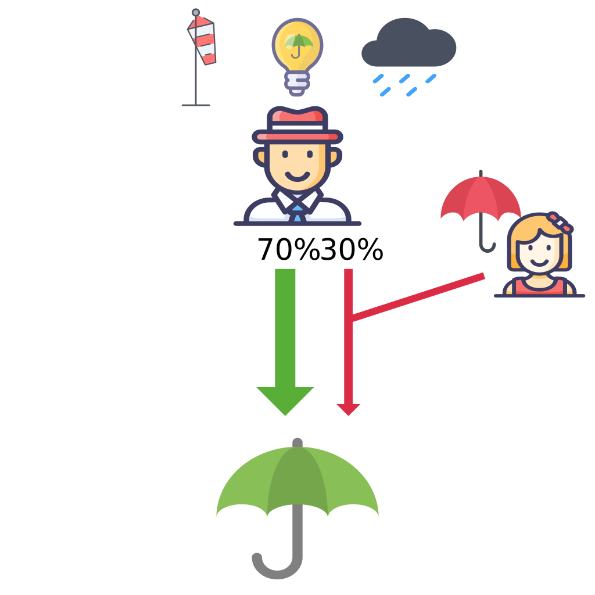

<!-- 
### Problem

In this paper we propose a new approach to probabilistic argumentation problems based on probabilistic logic programming (PLP).
Probabilistic argumentation problems augment a traditional *abstract argumentation framework* (AAF) with probabilities: nodes are atomic arguments and edges denote the attack relation. 
Both arguments and relations can be associated with probabilities.


For probabilistic AAFs there are different approaches to define the semantics of probabilities and reasoning techniques specific to probabilistic AAFs.
On the contrary, PLP languages and systems aim at offering general purpose tools to reason and learn in structured domains under uncertainty.
In this paper we address the question as to whether PLP systems can be used to define semantics and reasoning techniques for probabilistic argumentation problems.
Our answer is divided in two parts: 
1. a mapping from probabilistic AAFs to probabilistic logic programs;
2. a PLP semantics and system, [smProbLog](https://github.com/PietroTotis/smProblog), which provide reasoning and learning tools suitable to this type of programs. 

### What do probabilities mean?

Probabilistic logic programs are logic programs in which some of the facts are annotated with probabilities.
For instance in this program the facts ``rain`` and ``wind`` are *probabilistic* because they belong to the program with some probability. 
Taking the umbrella or wearing the scarf are inferred from these two facts according to the logic rules.

```
0.4::rain.                  % probabilistic facts
0.7::wind.                   
umbrella :- rain, not wind. % logic rules
scarf :- rain.
scarf :- wind.
query(umbrella).            % compute the probability of taking the umbrella
```

Distribution semantics[^1] define the semantics of probabilities: each probabilistic fact $p::f.$
represents an *independent* choice to include or not the fact in the program. 
A total choice is a set of choices for all facts: the *deterministic* program obtained by combining a total choice with the logical rules is a *possible world*.
The probability of success of a query is the sum of the probabilities of the possible worlds where queried atom can be derived to be true.

In probabilistic AAFs there are two approaches[^2] to define the semantics and reasoning techniques of probabilities:
1. The constellations approach.
2. The epistemic approach.

The constellations approach considers probabilities an expression of uncertainty over the structure of the graph. 
Similarly to distribution semantics, the probabilities induce a set of possible worlds corresponding to all possible subgraphs.
The probability of a subgraph is the combination of the probabilities of the chosen nodes and edges, and the probability of accepting an argument is the sum of the probabilities of the argument graphs where the argument is acceptable.

This approach however presents two issues regarding semantics:
1. the independence assumption of including or not an argument in the graph, while the goal of an AAF is to model their dependencies.
2. the semantics of the possible worlds where an attack is chosen but one of the two arguments involved is not (e.g. worlds on the right-hand side)

On the other hand, in the epistemic approach probabilities express *degrees of belief* in the arguments, and the structure of the graph is no longer uncertain.
Arguments with probability higher than 0.5 are considered accepted, otherwise rejected. 
Reasoning on epistemic argument graphs thus consists in finding a family of probability distribution that satisfies a given set of properties, e.g. coherency, rationality,..., with respect to the structure of the argument graph.
 
For example the belief assignment in the picture is not rational because both $a_1$ and $a_2$ are accepted, but also the attack between the two receives a high degree of belief.

By mapping probabilistic argument graphs to PLP we introduce a novel perspective which combines the two approaches.
We model explicitly degrees of belief as in the epistemic approach, but we reason over this uncertainty with probabilistic logic programs and the distributions semantics, thus in terms of possible worlds as in the constellations approach.
The key points of our approach are:
1. The probability of an argument represents a belief bias *independent* of other arguments.
    It summarizes all the epistemic effects of the supporters of an argument which are not relevant to represent explicitly.
2. An attack $(a,b)$ with probability $p$ defines an *inhibition* of the belief in $b$ proportional to $p$ when $a$ is believed.


### Mapping probabilistic AAFs to PLP

Judea Pearl[^3] remarks how the combination of probability theory and graphs representing context dependencies are fundamental to model beliefs:
> We will also stress that probability theory is unique in its ability to process context-sensitive beliefs, and what makes the processing computationally feasible is that the information needed for specifying context dependencies can be represented by graphs and manipulated by local propagation.

We follow this principle in interpreting the argument graph as the representation of context dependencies between arguments:
1. We map arguments to logical atoms that are inferred from logical rules
2. We map arguments' probabilities to probabilistic facts which model a bias independent of other arguments. Any argument can be inferred from its bias.
3. We map attacks to logic rules with *negation in the head* annotated with the attack's probability.

```
0.6::bias(hotel_X).
0.8::bias(hotel_Y).
0.4::bias(expensive).
0.2::bias(noise).

arg(X) :- bias(X).

0.7::¬arg(hotel_Y) :- arg(hotel_X).
0.4::¬arg(hotel_X) :- arg(hotel_Y).
0.8::¬arg(hotel_Y) :- arg(noise).
0.9::¬arg(hotel_X) :- arg(expensive).

query(arg(X)).
```

Annotated rules are a syntactic feature that is equivalent to an additional probabilistic fact in the body, for instance:
```
0.8::umbrella :- rain, not wind.
```
is equivalent to:
```
0.8 :: remember.
umbrella :- remember, rain, not wind.
```
Moreover, negation in the head models the so-called *inhibition effect*, which expresses an inhibition of the belief of the head of the rule proportional to its probability.

```
0.3::friend_brings_umbrella.
¬umbrella :- friend_brings_umbrella.
```
is internally rewritten as:

```
0.3::friend_brings_umbrella.
umbrella :- umbrella_pos, umbrella_neg.
umbrella_pos :- remember, rain, not wind.
umbrella_neg :- friend_brings_umbrella.
```

<div style="display:flex;">


</div>

Moreover, the flexibility and expressivity of PLP can be exploited to encode more complex argumentation problems than basic AFFs, for instance expressing supports with regular rules (as with bias) or joint attacks or supports with rules with multiple arguments in the body.

### The joint probability distribution

The programs obtained from this mapping define a *joint probability distribution* over the arguments. 
The joint probability (belief) distribution induced by the argument graph resembles the description of N. Nilsson[^4] of how humans reason over beliefs:
> If we were to examine the relationships among all of our beliefs carefully, an impossible task in practice but one that is interesting to think about, we would see that some of them should make others more credible and some less. They would even compete among themselves with conflicting influences. We can imagine all of the beliefs in our large network of beliefs “fighting it out” to agree finally on the strength of each belief in the network. When they do finally agree, we say that the beliefs cohere.

The joint probability distribution can be analyzed with the typical PLP tools and algorithms offered by PLP systems.
Conditional probabilities, expressed by means of *evidence*, can be queried to study how the beliefs change when new information about the truth of the arguments is provided.
<iframe src="belief.html" title="Beliefs animation" height="400" width=700" frameBorder="0"></iframe>

Most probable explanation (MPE) queries return the most probable possible world where the given evidence holds. 
They can thus be used to find the set of beliefs which contribute the most to believing one or more arguments.

Finally, *learning from interpretations* (lfi) 
[^1]: [T. Sato, "A Statistical Learning Method for Logic Programs with Distribution Semantics", ICLP 1995.](https://rjida.meijo-u.ac.jp/reference/ICLP95.pdf)
[^2]: [A. Hunter, "A probabilistic approach to modelling uncertain logical arguments", Int. J. Approx. Reasoning, 2013](http://www0.cs.ucl.ac.uk/staff/a.hunter/papers/ijar12.pdf)
[^3]: [J. Pearl, "Probabilistic reasoning in intelligent systems: networks of plausible inference", Rev. 2. ed. Morgan Kaufmann, 2009](https://dl.acm.org/doi/10.5555/534975).
[^4]: [N. Nilsson, "Understanding Beliefs.", The MIT Press Essential Knowledge series. MIT Press, 2014](https://mitpress.mit.edu/9780262526432/understanding-beliefs/)
 -->
